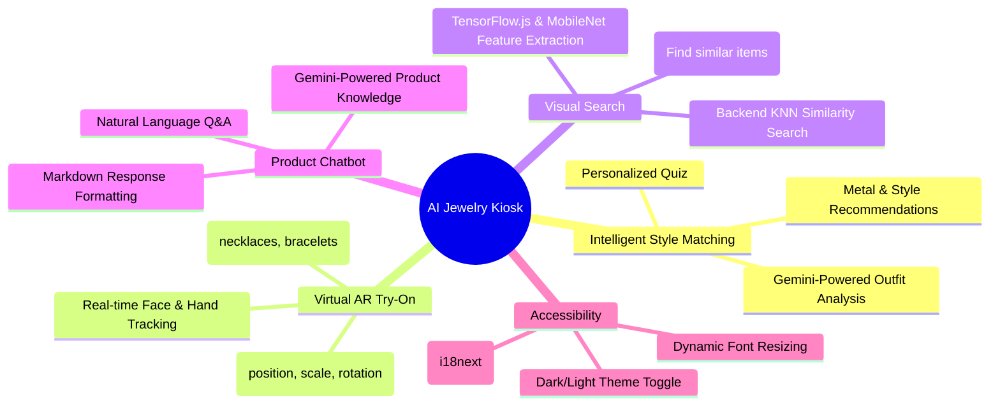

# 💎 EVOL JEWELS AI Stylist

<div align="center">
  
</div>

<br>

<p align="center">
  <strong>Intelligent AI-Powered Kiosk for a Hyper-Personalized Jewelry Shopping Experience</strong><br>
  <em>Unleash Your Style, Elevate Every Moment</em>
</p>

<br>

<p align="center">
  <a href="#"></a>&nbsp;
  <a href="#"></a>&nbsp;
  <a href="#"></a>&nbsp;
  <a href="#"></a>&nbsp;
  <a href="#"></a>
</p>

<br>

<p align="center">
  <a href="#overview">Overview</a> •
  <a href="#core-features">Features</a> •
  <a href="#system-architecture">Architecture</a> •
  <a href="#tech-stack">Tech Stack</a> •
  <a href="#-project-structure">Project Structure</a> •
  <a href="#getting-started">Getting Started</a> •
  <a href="#api-reference">API Reference</a>
</p>

<br>

## Overview

> This is an **AI-Powered Jewelry Styling Kiosk or Website** designed to give customers a fun, hyper-personalized, and interactive shopping experience.

The Evol Jewels AI Stylist is a sophisticated proof-of-concept application built with a modern React frontend and an Express backend. It integrates several advanced AI and computer vision features to redefine the retail experience for jewelry.

### Key Objective

*To automate and enhance the customer's styling journey through a suite of intelligent tools, including AI-driven recommendations, augmented reality try-ons, and visual search. This reduces friction in the discovery process and provides a memorable, high-tech interaction with the brand.*

<br>

## Core Features

<div align="center">

### System Capabilities

</div>



<table align="center">
<tr>
<td align="center" width="25%">

**AI Style Matching**
<br>
Uses a Gemini-powered backend to analyze quiz answers and outfit descriptions, providing hyper-personalized metal and style recommendations.

</td>
<td align="center" width="25%">

**Virtual AR Try-On**
<br>
Leverages MediaPipe for real-time face and hand tracking to overlay 3D jewelry models, creating an immersive try-on experience.

</td>
<td align="center" width="25%">

**Visual Product Search**
<br>
Allows users to upload a photo of any jewelry piece, using MobileNet and a KNN algorithm to find the closest matches in the catalog.

</td>
<td align="center" width="25%">

**Accessible & Multilingual**
<br>
Features a full accessibility suite, including dynamic font resizing and multilingual support (EN, HI, TE) powered by `react-i18next`.

</td>
</tr>
</table>

<br>

## System Architecture

<div align="center">

### Application Data Flow

</div>

```mermaid
graph TD
    subgraph "User Interface (React SPA)"
        A[Customer Interaction <br> Quiz, Text Input, Image Upload]
        B(VibeContext State Management)
        C[UI Components <br> Screens, Modals]
    end

    subgraph "Client-Side AI/ML"
        D[MediaPipe <br> Face/Hand Tracking]
        E[TensorFlow.js <br> MobileNet Feature Extraction]
    end

    subgraph "Backend Server (Node.js/Express)"
        F(API Endpoints <br> /api/analyze-outfit, /api/image-search, etc.)
    end

    subgraph "External & Internal Services"
        G[Google Gemini API]
        H[Google Custom Search API]
        I[KNN Search Logic <br> (using product_features.json)]
    end

    subgraph "User Output"
        J[Personalized Results & AR View]
    end

    A --> B
    B --> C

    C -- Webcam Feed --> D
    D -- Landmarkers --> C

    C -- Uploaded Image --> E
    E -- Feature Vector --> F

    C -- API Requests --> F
    
    F -- Outfit Analysis --> G
    G -- Search Queries --> H
    
    F -- KNN Search --> I

    F -- AI Responses --> C
    C --> J

    classDef userInput fill:#e1f5fe,stroke:#0277bd,stroke-width:2px,color:#000
    classDef clientML fill:#e8f5e8,stroke:#2e7d32,stroke-width:2px,color:#000
    classDef backend fill:#f3e5f5,stroke:#7b1fa2,stroke-width:2px,color:#000
    classDef services fill:#fff3e0,stroke:#ef6c00,stroke-width:2px,color:#000
    classDef output fill:#e3f2fd,stroke:#1565c0,stroke-width:2px,color:#000

    class A,B,C userInput
    class D,E clientML
    class F backend
    class G,H,I services
    class J output
```

<br>

## Tech Stack

<div align="center">

| Layer | Technology / Library | Purpose |
| :--- | :--- | :--- |
| **Frontend (Client)** | `React 19`, `Vite`, `Tailwind CSS` | Core UI, rapid development, utility-first styling. |
| **State Management** | `React Context API` (`VibeContext`) | Centralized state for navigation, cart, quiz, and AI results. |
| **AI/ML (Client)** | `TensorFlow.js (MobileNet)`, `MediaPipe` | In-browser feature extraction for visual search; real-time AR tracking. |
| **Backend (Server)** | `Node.js`, `Express` | REST API for handling secure AI calls and business logic. |
| **AI/ML (Server)** | `Google Gemini API`, `Google Custom Search` | Contextual style analysis, chatbot, and image grounding. |
| **Internationalization** | `react-i18next`, `i18next-http-backend` | Multilingual text rendering and dynamic language loading. |
| **3D Rendering** | `THREE.js` | Loading and rendering `.glb` 3D models for the AR try-on feature. |
| **DevOps & Tooling** | `npm`, `ESLint`, `Vite` | Package management, code linting, and build tooling. |

</div>

<br>

## 📂 Project Structure

The repository is organized into a modular structure that separates the frontend application, backend server, and public assets.

```plaintext
💎 evol-jewels-website/
│
├── 🚀 server/
│   ├── 🤖 server.js                  # Main Express API server for AI logic.
│   ├── 🔑 .env                       # Environment variables (API keys).
│   ├── 🧠 feature_extractor.js       # Node script to generate ML feature vectors.
│   └── 📊 product_features.json      # Pre-computed feature vectors for visual search.
│
├── ⚛️ src/
│   ├── 📱 components/                # Reusable React components (Screens & Shared UI).
│   ├── 🌐 context/VibeContext.jsx    # Global state management for the entire app.
│   ├── 📈 data/productData.js        # Static product catalog information.
│   ├── 🧠 logic/productUtils.js      # Core business logic for filtering and scoring.
│   ├── 🌍 i18n.js                     # Configuration for react-i18next.
│   ├── 🎬 App.jsx                     # Main application component and screen router.
│   └── 🏁 main.jsx                    # Application entry point.
│
├── 🌐 public/
│   ├── 🖼️ media/                      # Product images with backgrounds.
│   ├── 🖼️ media_bgr/                  # Background-removed product images for ML.
│   ├── 🗿 3dmodels/                  # GLB files for AR try-on.
│   ├── 🤖 models/                    # MediaPipe `.task` model files.
│   └── 🌍 locales/                   # Translation JSON files (en, hi, te).
│
├── 📄 package.json                   # Project dependencies and scripts.
├── 🎨 tailwind.config.js              # Tailwind CSS theme and configuration.
├── vite.config.js                    # Vite build tool configuration.
└── 📖 README.md                       # This documentation file.
```

<br>

## Getting Started

<details>
<summary><strong>Local Development Setup</strong></summary>

### Prerequisites

This project requires two main dependencies to run both the client and the backend server:

*   **Programming Language:** `JavaScript` (Node.js)
*   **Package Manager:** `npm` (Node Package Manager)

### Installation

Follow these steps to get your development environment running.

1.  **Clone the repository:**
    ```bash
    git clone https://github.com/sashankbanda/evol-jewels-website.git
    cd evol-jewels-website
    ```

2.  **Install all dependencies:**
    This will install both the frontend (React/Vite) and backend (Express) packages.
    ```bash
    npm install
    ```

3.  **Configure API Keys:**
    Open the `server/.env` file and replace the placeholder values with your actual API keys:
    *   `GEMINI_API_KEY`
    *   `GOOGLE_SEARCH_API_KEY`
    *   `CUSTOM_SEARCH_ENGINE_ID`

4.  **Generate Image Features (Critical Step):**
    The visual search relies on pre-calculated image feature vectors. You must run this script once.
    ```bash
    npm run extract-features
    ```
    *This process loads MobileNet, reads all product images, and saves the feature vectors to `server/product_features.json`.*

### Usage

You need two separate terminal windows to run the frontend and backend simultaneously.

1.  **Start the Backend Server:**
    ```bash
    npm run server
    ```
    *This hosts the API endpoints for the Gemini and image search services on `http://localhost:3001`.*

2.  **Start the Frontend Application:**
    ```bash
    npm run dev
    ```
    *This starts the React development server, usually on `http://localhost:5173`.*

</details>

<br>

## API Reference

The backend server exposes a simple REST API to handle computationally expensive or secure operations.

<details>
<summary><strong>POST /api/analyze-outfit</strong> - AI-Powered Outfit Analysis</summary>

Accepts quiz results and optional outfit text, returning a full Vibe Match analysis from Gemini, including grounded image URLs.

**Request Body:**
```json
{
  "outfitText": "I'm wearing a deep blue kurta for a wedding reception.",
  "quizKey": "Party/Celebration_Classic_Polished Gold"
}
```

**Successful Response (200 OK):**
```json
{
  "keywords": {
    "metal_match": "Polished Gold",
    "description": "This metal choice enhances the royal blue of the kurta..."
  },
  "vibeMatch": {
    "icon": "Priyanka Chopra: Classic Edge",
    "subtitle": "...",
    "celebrityImage": "https://...",
    "movieScene": "...",
    "movieImage": "https://..."
  },
  "outfitImageUrl": "https://..."
}
```
</details>

<details>
<summary><strong>POST /api/product-chat</strong> - Product Information Chatbot</summary>

Accepts a user query and the full product catalog, returning a contextual answer from Gemini.

**Request Body:**
```json
{
  "productDataJson": "[{...}, {...}]",
  "userQuery": "Do you have any silver rings under ₹50,000?"
}
```

**Successful Response (200 OK):**
```json
{
  "answer": "Yes, we have several beautiful matte silver rings! For example, the **'Celestial Orbit Ring'** is priced at **₹45,000**."
}
```
</details>

<details>
<summary><strong>POST /api/image-search</strong> - Visual Product Search</summary>

Accepts a feature vector from a user-uploaded image and returns the IDs of the top 3 most similar products.

**Request Body:**
```json
{
  "queryFeatureVector": [0.123, -0.456, ..., 0.789]
}
```

**Successful Response (200 OK):**
```json
{
  "productIds": [42, 15, 58]
}
```
</details>

<br>

---

**[Star this repository](https://github.com/sashankbanda/evol-jewels-website)** | **[Report an Issue](https://github.com/sashankbanda/evol-jewels-website/issues)** | **[View Technical Architecture](./technical_architecture.md)**
