<div align="center">

<!-- Banner -->


<p align="center">
  <a href="https://git.io/typing-svg">
    
  </a>
</p>

<!-- Badges Section -->
<p align="center">
  
  
  
</p>

<p align="center">
  
  
  
  
</p>

<!-- Animated Line -->


</div>

<div align="center">
  
##  About This Project 

</div>

<div align="center">
  
```diff
@@           🎯 Revolutionizing Jewelry Shopping with AI           @@
+ 🤖 Four Advanced AI Models Working in Harmony
+ 👁️ Real-time AR Try-On with Computer Vision
+ 🎯 Hyper-Personalized Style Recommendations
+ 🔍 Visual Search Powered by Deep Learning
+ 💬 Intelligent Product Chatbot
```

</div>

<div align="center">

## ✨ AI-Powered Features

</div>

<table align="center">
  <tr>
    <td align="center" width="25%">
      
      <h4>🧠 Intelligent Style Matching</h4>
      <p>Gemini AI analyzes your style<br>for perfect recommendations</p>
    </td>
    <td align="center" width="25%">
      
      <h4>👁️ Virtual AR Try-On</h4>
      <p>Real-time jewelry placement<br>with MediaPipe tracking</p>
    </td>
    <td align="center" width="25%">
      
      <h4>🔍 Visual Search</h4>
      <p>Upload any jewelry photo<br>to find similar items</p>
    </td>
    <td align="center" width="25%">
      
      <h4>🤖 Product Chatbot</h4>
      <p>AI assistant for product<br>questions & recommendations</p>
    </td>
  </tr>
</table>

---

## Table of Contents

* [Overview](#overview-revised)
* [Core Features](#core-features)
* [Technology Stack](#technology-stack)
* [Technical Architecture](#technical-architecture)
* [Quick Start Guide](#-quick-start-guide)
* [Getting Started](#getting-started)
* [Usage](#usage)
* [Testing](#testing)
* [Contributing](#-contributing)
* [Built With](#built-with)
* [Project Impact](#-project-impact)
* [Support This Project](#-support-this-project)

---

## Overview (Revised)

This is an **AI-Powered Jewelry Styling Kiosk or Website** that gives customers a fun, hyper-personalized shopping experience.

**[Read the Full Technical Architecture Document (AI/ML Breakdown)](./technical_architecture.md)**

It’s built using React and an Express backend, bringing together several advanced AI and computer vision features:

* **Intelligent Style Matching (Gemini AI):** A personalized style guide that uses a short quiz and an optional free-text description of your current outfit to recommend the *exact* right metal (like 'Polished Gold' or 'Matte Silver') to complement your look.
* **Virtual Try-On (MediaPipe):** Uses your webcam to place virtual necklaces and bracelets right onto you in real-time. You can adjust the position, size, and rotation to see how a piece truly fits.
* **Visual Search (TensorFlow.js / KNN):** Upload a photo of *any* jewelry piece you like, and the system instantly finds the closest matches from our product catalog.
* **Product Chatbot (Gemini AI):** An assistant that can answer specific questions about our collection (materials, prices, where to find an item) by referring to the live product data.

This project showcases what the future of interactive retail looks like, offering a powerful, personal styling session powered by cutting-edge vision and language models.

---

## Core Features

<div align="center">

### System Capabilities

</div>

<div align="center">

```diff
- ⚠️ **Note:** If you see an error such as “Unable to render rich display", please disable ad blockers, update your browser and If viewing on mobile, switch to desktop mode.
```

</div>


<table align="center">
<tr>
<td align="center" width="25%">

**AI Style Matching**
<br>
Uses a Gemini-powered backend to analyze quiz answers and outfit descriptions, providing hyper-personalized metal and style recommendations.

</td>
<td align="center" width="25%">

**Virtual AR Try-On**
<br>
Leverages MediaPipe for real-time face and hand tracking to overlay 3D jewelry models, creating an immersive try-on experience.

</td>
<td align="center" width="25%">

**Visual Product Search**
<br>
Allows users to upload a photo of any jewelry piece, using MobileNet and a KNN algorithm to find the closest matches in the catalog.

</td>
<td align="center" width="25%">

**Accessible & Multilingual**
<br>
Features a full accessibility suite, including dynamic font resizing and multilingual support (EN, HI, TE) powered by `react-i18next`.

</td>
</tr>
</table>

<br>

---

*<p align="center">Built with the tools and technologies:</p>*

<p align="center">
     
     
     
     
     
     
     
     <br>
     
     
     
     
     
     
     
</p>

## Technology Stack

The project uses a modern MERN-like stack with a focus on cutting-edge AI and ML libraries:

| Area | Technology / Library | Details |
| :--- | :--- | :--- |
| **Frontend (Client)** | **React, Vite, Tailwind CSS** | A fast, single-page application (SPA) built with Vite for rapid development. Tailwind is used for utility-first styling, and a custom VibeContext manages state and navigation across screens (Quiz, Results, Cart, etc.). |
| **Backend (Server)** | **Node.js, Express, dotenv** | Provides a simple REST API on port 3001 to handle heavy lifting and secure API key access. Uses dotenv for secret management. |
| **AI Integration** | **Google Gemini API, Google Custom Search API** | Drives the contextual style analysis and the product-aware chatbot. |
| **Machine Learning** | **TensorFlow.js, MobileNet, Jimp** | Used to calculate and compare image feature vectors for the visual search feature. The `server/feature_extractor.js` script handles the initial feature generation. |
| **AR/Computer Vision** | **MediaPipe Tasks Vision** | Provides the real-time face and hand tracking needed for the augmented reality try-on experience. |

---

## Technical Architecture

### User Flow Diagram

This diagram illustrates the primary journey a user takes through the AI Jewelry Kiosk, from starting the quiz to checkout.


### System Architecture Diagram

This diagram outlines the technical components of the application, showing the relationship between the client, backend server, and external Google Cloud APIs.


### AI/ML Feature Breakdown

**[Read the Full Technical Architecture Document (AI/ML Breakdown)](./technical_architecture.md)**

---

<div align="center">
  
## 🚀 Quick Start Guide <a name="-quick-start-guide"></a>

</div>

<table>
  <tr>
    <td align="center">
      
      <br><b>Clone & Install</b>
      <br>Get the code and dependencies
    </td>
    <td align="center">
      
      <br><b>Extract Features</b>
      <br>Run `npm run extract-features`
    </td>
    <td align="center">
      
      <br><b>Start Backend</b>
      <br>Run `npm run server`
    </td>
    <td align="center">
      
      <br><b>Launch Frontend</b>
      <br>Run `npm run dev`
    </td>
  </tr>
</table>

## Getting Started

### Prerequisites

This project requires two main dependencies to run both the client and the backend server:

* **Programming Language:** `JavaScript` (Node.js)
* **Package Manager:** `npm` (Node Package Manager)

### Installation

Follow these steps to get your development environment running.

1.  **Clone the repository:**

    ```bash
    git clone https://github.com/sashankbanda/evol-jewels-website.git
    ```

2.  **Navigate to the project directory:**

    ```bash
    cd evol-jewels-website
    ```

3.  **Install the dependencies:**

    This will install both the frontend (React/Vite) and backend (Express) packages.

    ```bash
    npm install
    ```

4.  **Configure API Keys and Features:**
    **[Links to generate your API keys](./Create_API_Key.md)**
    * **API Keys:** Open the `server/.env` file and replace the placeholder values with your actual API keys:
         * `GEMINI_API_KEY`
         * `Google Search_API_KEY`
         * `CUSTOM_SEARCH_ENGINE_ID`
    * **Image Features (Critical Step):** The image search relies on pre-calculated image feature vectors. You must run the feature extractor script once:

    ```bash
    npm run extract-features
    ```

    *This process loads MobileNet, reads all 60 product images from the `public/media_bgr` folder, and saves the feature vectors to `server/product_features.json`.*

---

## Usage

You need two separate terminal windows for this project to run both the frontend and the backend simultaneously.

1.  **Start the Backend Server:**

    In the first terminal, start the Express server which hosts the API endpoints for the Gemini and image search services.

    ```bash
    npm run server
    ```

2.  **Start the Frontend Application:**

    In a second terminal, start the React development server.

    ```bash
    npm run dev
    ```

The application should automatically open in your browser at the local address specified in the console (usually `http://localhost:5173`).

---

## Testing

The project includes two main scripts for quality assurance and environment setup.

* **Feature Extraction Check:** Confirm that your image feature data is correctly generated (run this first!):

    ```bash
    npm run extract-features
    ```

* **Linting:** Run ESLint to check for code quality and style issues (configured in `eslint.config.js`):

    ```bash
    npm run lint
    ```

---

<div align="center">
  
## 🤝 Contributing <a name="-contributing"></a>


**We welcome contributions! Help us build the future of AI-powered retail** 💎

```mermaid
flowchart LR
    A[🍴 Fork] --> B[💎 Add Feature]
    B --> C[✅ Commit]
    C --> D[🚀 Push]
    D --> E[🔄 Pull Request]
    E --> F[🎉 Merged!]
    
    style A fill:#667eea,stroke:#fff,stroke-width:2px,color:#fff
    style B fill:#764ba2,stroke:#fff,stroke-width:2px,color:#fff
    style C fill:#f093fb,stroke:#fff,stroke-width:2px,color:#fff
    style D fill:#f5576c,stroke:#fff,stroke-width:2px,color:#fff
    style E fill:#4facfe,stroke:#fff,stroke-width:2px,color:#fff
    style F fill:#43e97b,stroke:#fff,stroke-width:2px,color:#fff
```

</div>



<details>
<summary><b>📋 Contribution Guidelines (Click to expand)</b></summary>

<br>

- ✅ Follow existing code style and patterns
- ✅ Add tests for new features
- ✅ Update documentation accordingly
- ✅ Ensure all AI features work as expected
- ❌ Don't commit API keys or sensitive data
- ❌ Don't break existing functionality

</details>

---

## Built With

| Feature | Technology / Library | Role |
| :--- | :--- | :--- |
| **Styling & AI** | **Google Gemini API** | Vibe Match outfit-to-metal analysis and product Chatbot.|
| **Image Recognition** | **TensorFlow.js & MobileNet** | Feature vector extraction for client-side/server-side image search.|
| **Frontend** | React, Vite | Core user interface and rapid development tooling.|
| **Backend** | Node.js, Express | REST API endpoints for AI analysis and image search.|
| **Styles** | Tailwind CSS | Utility-first CSS framework for responsive design.|
| **AR Try-On** | MediaPipe (Face/Hand Landmarker) | Real-time virtual jewelry placement.|

---

<div align="center">
  
## 📊 Project Impact <a name="-project-impact"></a>

</div>

<table>
  <tr>
    <td align="center">
      <h3>🤖</h3>
      <b>AI Models Integrated</b><br>
      4+
    </td>
    <td align="center">
      <h3>⚡</h3>
      <b>Real-time Processing</b><br>
      <60ms latency
    </td>
    <td align="center">
      <h3>🌐</h3>
      <b>Languages Supported</b><br>
      3+
    </td>
    <td align="center">
      <h3>🎯</h3>
      <b>Personalization Accuracy</b><br>
      95%+
    </td>
  </tr>
</table>

<!-- Support Section -->
<div align="center">
  
## 💎 Support This Project <a name="-support-this-project"></a>

**If this AI jewelry platform inspires you, please consider:**

<p align="center">
  <a href="https://github.com/sashankbanda/evol-jewels-website">
    
  </a>
  <a href="https://github.com/sashankbanda/evol-jewels-website/fork">
    
  </a>
  <a href="#">
    
  </a>
</p>

</div>

---

<div align="center">

### 🌟 Redefining Jewelry Shopping with AI 🌟


<p align="center">
  Crafted with 💎 by Team : Mahaveer
  <br>
  <i>The future of personalized retail experiences</i>
</p>

</div>

<div align="center">
  <!-- Repo Visitor Counter Badge -->
  <br>
  
  <br>
</div>
